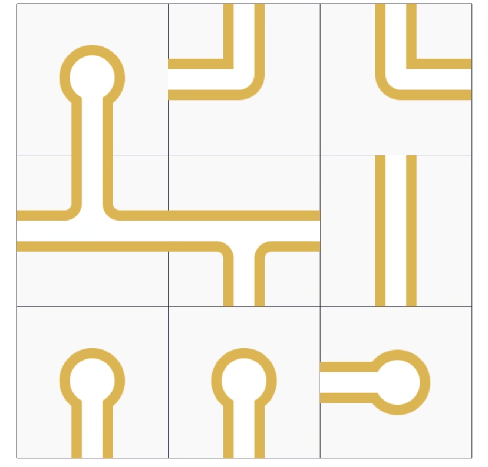

# Projecto de Inteligência Artificial 2023/2024


## 1 Introdução
O projeto da unidade curricular de Inteligência Artificial tem como objetivo desenvolver um programa em Python 3.8 que resolva uma adaptação do problema *Pipe Mania* utilizando técnicas de procura e resolução de problemas de Inteligência Artificial.<br>
O jogo *Pipe Mania* é um jogo de quebra-cabeças desenvolvido em 1989 pela The Assembly Line para o computador Amiga.<br>
Posteriormente foi adaptado para várias outras plataformas pela Lucasfilm Games, que lhe deu o nome de "Pipe Dream".<br>
O objetivo do jogo é construir um sistema de canalização funcional para evitar fugas de água.


## 2 Descrição do problema
O jogo *Pipe Mania* decorre numa grelha quadrada, em que cada posição contém uma peça de tubagem.<br>
O objetivo é rodar as peças de modo a que todas fiquem conectadas e a água possa circular sem fugas.<br>
A [Figura 1a](#figura-1a-estado-inicial) mostra um exemplo da disposição inicial de uma grelha. A [Figura 1b](#figura-1b-objetivosolução) mostra uma solução para essa mesma grelha.<br>
**Podemos assumir que uma instância de *Pipe Mania* tem uma solução única**.<br>

##### Figura 1a: Estado inicial

<br>

##### Figura 1b: Objetivo/Solução

<br>


## 3 Objetivo
O objetivo deste projeto é o desenvolvimento de um programa em Python 3.8.2 que, dada uma instância de *Pipe Mani*a, retorna a solução (única), i.e., todos os tubos conectados e sem fugas.
O programa deve ser desenvolvido num ficheiro `pipe.py`, que lê uma instância de *Pipe Mania* a partir do standard input no formato descrito na secção [4.1](#41-formato-do-input).
O programa deve resolver o problema utilizando uma técnica à escolha e imprimir a solução para o standard output no formato descrito na secção [4.2](#42-formato-do-output).

`python pipe.py <initial-state.txt>`

## 4 Formato de input e output
Num tabuleiro de *Pipe Mania* existem 4 ***tipos de peças***:
1. Peças de fecho (F), com orientação cima (C), baixo (B), esquerda (E) e direita (D);
2. Peças de bifurcação (B), com orientação cima (C), baixo (B), esquerda (E) e direita (D);
3. Peças de volta (V), com orientação cima (C), baixo (B), esquerda (E) e direita (D);
4. Peças de ligação (L), com orientação horizontal (H) e vertical (V).

A [Figura 2](#figura-2-designações-para-as-peças-de-pipe-mania) contém a designação para cada uma das peças que podem existir num tabuleiro.<br>
A título de exemplo, as peças da primeira linha da [Figura 1a](#figura-1a-estado-inicial) correspondem a FB / VC / VD, enquanto que as peças da segunda fila correpondem a BC / BB / LV.


##### Figura 2: Designações para as peças de *Pipe Mania*
**FC**<br>


**FB**<br>


**FE**<br>


**FD**<br>

<br>
<br>

**BC**<br>


**BB**<br>


**BE**<br>


**BD**<br>

<br>
<br>

**VC**<br>


**VB**<br>


**VE**<br>


**VD**<br>

<br>
<br>

**LH**<br>


**LV**<br>

<br>
<br>

### 4.1 Formato do input
As instâncias do problema *Pipe Mania* seguem o seguinte formato:
```
<pipe-piece-l1c1> ... <pipe-piece-l1cN>
<pipe-piece-l2c1> ... <pipe-piece-l2cN>
...
<pipe-piece-lNc1> ... <pipe-piece-lNcN>
```

Os valores possíveis para `<pipe-piece-*>` são strings de duas letras, em que a primeira tem como domínio a **identificação da peça {F,B,V,L}** e a segunda tem como domínio a **orientação da peça {C,B,E,D,H,V}**.

##### 4.1.1 Exemplo
O ficheiro de input que descreve a instância da [Figura 1a](#figura-1a-estado-inicial) é o seguinte:
```
FB VC VD
BC BB LV
FB FB FE
```

<br>


```
FB\tVC\tVD\n
BC\tBB\tLV\n
FB\tFB\tFE\n
```


### 4.2 Formato do output
O output do programa deve descrever uma solução para o problema de *Pipe Mania* descrito no ficheiro de input, i.e., uma grelha completamente preenchida que respeite as regras previamente enunciadas. 
O output deve seguir o seguinte formato:
- Uma linha por cada linha da grelha.
- Cada linha indica o conteúdo da respetiva linha da grelha.

##### 4.2.1 Exemplo
O output que descreve a solução da [Figura 1b](media/) é:

```
FB VB VE
BD BE LV
FC FC FC
```

```
FB\tVB\tVE\n
BD\tBE\tLV\n
FC\tFC\tFC\n
```

## 5 Implementação
Nesta secção é descrito o código que poderá ser usado no projeto e o código que deverá ser implementado no projeto.

### 5.1 Código a utilizar
Para a realização deste projeto devem ser utilizados os ficheiros Python, a ser disponibilizados na página da unidade curricular, que implementam os algoritmos de procura que irão ser dados ao longo da época letiva.<br>
O mais importante é compreender para que servem e como usar as funcionalidades implementadas nestes ficheiros.<br>
Estes ficheiros não devem ser alterados. Se houver necessidade de alterar definições incluídas nestes ficheiros, estas alterações devem ser feitas no ficheiro de código desenvolvido que contém a implementação do projeto.<br>
Outras dependências não são permitidas, exceto o Python package numpy, que pode ser útil para representar a solução e ter acesso a operações sobre arrays.
##### 5.1.1 Procuras
No ficheiro search.py estão implementadas as estruturas necessárias para correr os diferentes algoritmos de procura. Destacam-se:
- **Classe Problem**: Representação abstrata do problema de procura;
- **Função breadth_first_tree_search**: Procura em largura primeiro;
- **Função depth_first_tree_search**: Procura em profundidade primeiro;
- **Função greedy_search**: Procura gananciosa;
- **Função astar_search**: Procura A*.


#### 5.1.2 Classe State
Esta classe representa os estados utilizados nos algoritmos de procura. O membro board armazena a configuração da grelha a que o estado corresponde.<br>
Abaixo é apresentado o código desta classe. Podem ser feitas alterações a esta classe, como por exemplo modificações ao método `__lt__(self, other)` para suportar funções de desempate mais complexas. No entanto, estas alterações devem ser devidamente justificadas com comentários no código.

```python
class PipeManiaState:
    state_id = 0
    
    def __init__(self, board):
        self.board = board
        self.id = PipeManiaState.state_id
        PipeManiaState.state_id += 1

    def __lt__(self, other):
        """ Este método é utilizado em caso de empate na gestão da lista
        de abertos nas procuras informadas. """
        return self.id < other.id
```

### 5.2 Código a implementar
#### 5.2.1 Classe Board
A classe Board é a representação interna de uma grelha de *Pipe Mania*. A implementação desta classe e respectivos métodos é livre.<br>
Pode, a título de exemplo, incluir os métodos para determinar valores adjacentes `adjacent_vertical_values` e `adjacent_horizontal_values` que recebem **dois argumentos**, as coordenadas na grelha **(linha, coluna)**, e devolvem um **tuplo com duas strings** que correspondem aos valores adjacentes **na vertical (acima, abaixo) e na horizontal (esquerda, direita)**, respectivamente. Caso não existam valores adjacentes, i.e. nas extremidades da grelha, devolvem **None**.<br>
Pode também implementar outros métodos, como por exemplo um método `get_value` que retorne o valor preenchido numa determinada posição, ou um método print que imprime a grelha no formato descrito na secção [4.2](#42-formato-do-output).<br>
Estes métodos poderão ser utilizados para fazer testes à restante implementação da classe.


```python
class Board:
""" Representação interna de uma grelha de PipeMania. """

    def adjacent_vertical_values(self, row: int, col: int) -> (str, str):
        """ Devolve os valores imediatamente acima e abaixo,
        respectivamente. """
        # TODO
        pass

    def adjacent_horizontal_values(self, row: int, col: int) -> (str, str):
        """ Devolve os valores imediatamente à esquerda e à direita,
        respectivamente. """
        # TODO
        pass

    # TODO: outros metodos da classe
```

#### 5.2.2 Função parse_instance
A função parse_instance é responsável por ler uma instância do problema no formato de input apresentado (secção [4.1](#41-formato-do-input)) e devolver um objeto do tipo Board que a represente. Esta função deve ler a instância a partir do standard input (stdin).

```python
@staticmethod
def parse_instance():
    """Lê a instância do problema do standard input (stdin)
    e retorna uma instância da classe Board.

    Por exemplo:
        $ python3 pipe_mania.py < input_T01

        > from sys import stdin
        > line = stdin.readline().split()
    """
    # TODO
    pass
```


#### 5.2.3 Classe PipeMania
A classe PipeMania herda da classe Problem definida no ficheiro search.py do código a utilizar e deve implementar os métodos necessários ao seu funcionamento.

O método actions recebe como argumento um estado e retorna uma lista de ações que
podem ser executadas a partir desse estado. O método result recebe como argumento um estado e uma ação, e retorna o resultado de aplicar essa ação a esse estado.
Numa primeira abordagem, muito simples e pouco eficiente, pode considerar que uma ação corresponde a uma rotação de 90° de uma certa peça da grelha. Neste caso, cada ação pode ser representada por um tuplo com 3 elementos (índice da linha, índice da coluna, rotação 90° clockwise/anti-clockwise), em que a peça do canto superior esquerdo corresponde às coordenadas (0,0). Por exemplo, (0, 1, False) representa a ação “rodar a peça da linha 0 e coluna 1 anti-clockwise”. Note que outras modelações, eventualmente mais complexas, deverão ser mais eficientes.<br>

Para suportar as procuras informadas, nomeadamente a procura gananciosa e a procura
A*, deve desenvolver uma heurística que consiga guiar da forma mais eficiente possível estas procuras. A heurística corresponde à implementação do método h da classe PipeMania.
Estafunção recebe como argumento um node, a partir do qual se pode aceder ao estado atual em node.state.<br>

De seguida é disponibilizado um protótipo da classe PipeMania que pode ser usado como base para a sua implementação.

```python
class PipeMania(Problem):
    def __init__(self, initial_state: Board, goal_state: Board):
        """ O construtor especifica o estado inicial. """
        # TODO
        pass

    def actions(self, state: State):
        """ Retorna uma lista de ações que podem ser executadas a
        partir do estado passado como argumento. """
        # TODO
        pass

    def result(self, state: State, action):
        """ Retorna o estado resultante de executar a 'action' sobre
        'state' passado como argumento. A ação a executar deve ser uma
        das presentes na lista obtida pela execução de
        self.actions(state). """
        # TODO
        pass

    def h(self, node: Node):
        """ Função heuristica utilizada para a procura A*. """
        # TODO
        pass
```


#### 5.2.4 Exemplos de utilização
De seguida, são apresentados alguns exemplos da utilização do código a desenvolver, assim como o respetivo output. Estes exemplos podem ser utilizados para testar a implementação.
Considere que o ficheiro initial-state.txt se encontra na diretoria "./boards/board-1/" e que contém a instância descrita na secção [4.1](#41-formato-do-input).

**Exemplo 1:**<br>
```python
# Ler grelha do figura 1a:
board = Board.parse_instance()
print(board.adjacent_vertical_values(0, 0))
print(board.adjacent_horizontal_values(0, 0))
print(board.adjacent_vertical_values(1, 1))
print(board.adjacent_horizontal_values(1, 1))
```

**Output:**
```
(None, BC)
(None, VC)
(VC, FB)
(BC, LV)
```
<br>
<br>

**Exemplo 2:**
```python
# Ler grelha do figura 1a:
board = Board.parse_instance()
# Criar uma instância de PipeMania:
problem = PipeMania(board)
# Criar um estado com a configuração inicial:
initial_state = PipeManiaState(board)
# Mostrar valor na posição (2, 2):
print(initial_state.board.get_value(2, 2))
# Realizar ação de rodar 90° clockwise a peça (2, 2)
result_state = problem.result(initial_state, (2, 2, True))
# Mostrar valor na posição (2, 2):
print(result_state.board.get_value(2, 2))
```

**Output:**
```
FE
FC
```

<br>
<br>

**Exemplo 3:**
```python
# Ler grelha do figura 1a:
board = Board.parse_instance()
# Criar uma instância de PipeMania:
problem = PipeMania(board)
# Criar um estado com a configuração inicial:
s0 = PipeManiaState(board)
# Aplicar as ações que resolvem a instância
s1 = problem.result(s0, (0, 1, True))
s2 = problem.result(s1, (0, 1, True))
s3 = problem.result(s2, (0, 2, True))
s4 = problem.result(s3, (0, 2, True))
s5 = problem.result(s4, (1, 0, True))
s6 = problem.result(s5, (1, 1, True))
s7 = problem.result(s6, (2, 0, False)) # anti-clockwise (exemplo de uso)
s8 = problem.result(s7, (2, 0, False)) # anti-clockwise (exemplo de uso)
s9 = problem.result(s8, (2, 1, True))
s10 = problem.result(s9, (2, 1, True))
s11 = problem.result(s10, (2, 2, True))
# Verificar se foi atingida a solução
print("Is goal?", problem.goal_test(s5))
print("Is goal?", problem.goal_test(s11))
print("Solution:\n", s11.board.print(), sep="")
```

**Output:**
```
Is goal? False
Is goal? True
Solution:
FB VB VE
BD BE LV
FC FC FC
```

<br>
<br>

**Exemplo 4:**
```python
# Ler grelha do figura 1a:
board = Board.parse_instance()
# Criar uma instância de PipeMania:
problem = PipeMania(board)
# Obter o nó solução usando a procura em profundidade:
goal_node = depth_first_tree_search(problem)
# Verificar se foi atingida a solução
print("Is goal?", problem.goal_test(goal_node.state))
print("Solution:\n", goal_node.state.board.print(), sep="")
```

**Output:**
```
Is goal? True
Solution:
FB VB VE
BD BE LV
FC FC FC
```
<br>
<br>
O valor de retorno das funções de procura é um objeto do tipo Node. Do nó de retorno podem ser retiradas as diversas informaçãoes, por exemplo, estado final (goal_node.state), a ação que levou ao estado final goal_node.action, e o nó precedente goal_node.parent.
